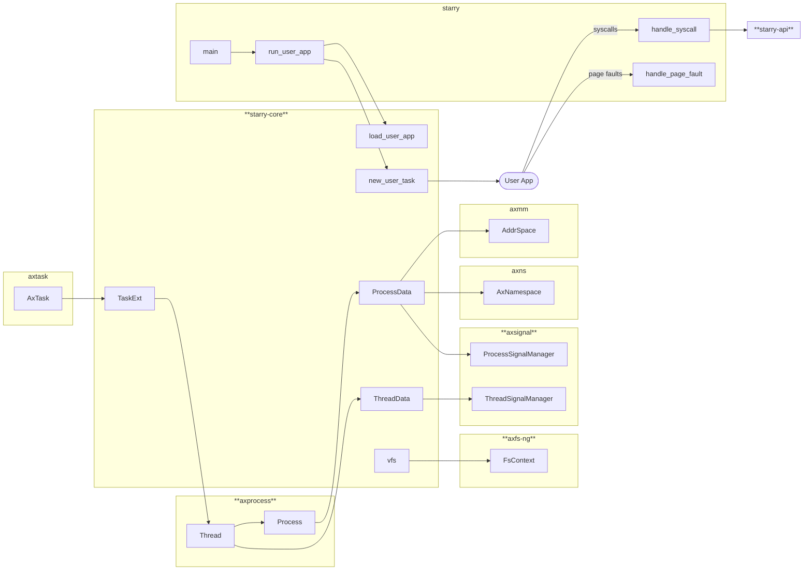

## 总体架构

大作业基于 [oscomp/starry-next](https://github.com/oscomp/starry-next) 和 [oscomp/arceos](https://github.com/oscomp/arceos) 项目，其中 ArceOS 提供了诸多关键组件的实现，Starry-Next 则在此基础上将其整合形成一套跨平台的 Rust 宏内核。

ArceOS 包含如下模块：

- axalloc: 处理内核内存分配
- axconfig: 统一提供系统相关配置
- axdriver: 提供多种底层驱动（块设备、网络设备、显示设备等）的对外接口
- axhal: 提供多种底层架构的统一硬件抽象层
- axlog: 负责日志打印
- axmm: 处理内存管理与页表相关
- axnet: 提供网络协议栈
- axns: 支持类似 thread-local 的任务局部存储
- axruntime: 提供系统入口与运行时支持
- axsync: 提供同步原语（Mutex）
- axtask: 负责任务调度与管理

在原有的 ArceOS 模块基础上，我们还加入了如下模块：

- axprocess: 管理进程 / 进程组 / 线程并实现了相关操作逻辑
- axfs-ng: 重构的文件系统模块，支持更全面的文件系统操作
- axsignal: 实现系统信号处理相关逻辑

## 独立 crate

这部分会阐述我们在 starry-next 中实现的独立 crate 以及他们的功能。

### `axfs-ng`

详见 [axfs-ng](./axfs-ng.md)。

### `axsignal`

详见 [axsignal](./axsignal.md)。

## 开发过程

在开发过程中，我们主要遇到以下几个问题：

### `TaskExt` 不析构

原版的 ArceOS 实现中，`TaskExt` 的内存只是被释放（dealloc）而没有被析构（drop），这会导致其中的资源无法被正确回收。修复了这一问题后，我们发现这披露了之前没被发现的下面的问题。

### 页表回收异常

在 Starry-Next 中，内核和用户空间的页表是共享的。在内核生成用户任务时，会将自己的页表浅拷贝到用户页表中。但在用户页表释放时（包含在 `TaskExt` 中），会将页表中的页逐一释放，这会导致内核页表中的页也被释放，从而导致异常。为此，我们引入 `clear_copy_range` 方法来在析构用户页表前清除从内核页表拷贝的部分，从而避免了这个问题。

### syscall 参数顺序

由于历史遗留原因，一些 syscall 在不同架构上的参数顺序不一致，而原版的 ArceOS 并没有考虑到这一点。我们按照 Linux 源码对此进行了修复。

### 内核访存缺页处理

内核在访问用户空间的内存时，如果该内存页不在页表中，内核会触发缺页异常，而故障处理函数会因为故障来自于内核而主动崩溃（因为在内核发生缺页是致命的，可能已经发生严重错误）。Linux 中通过改变异常处理表的方式来处理这个问题。在 Starry-Next 中，我们定义了一个 percpu 的变量 `ACCESSING_USER_MEMORY` 来标记当前是否正在访问用户空间的内存，如果是，则在故障处理函数中进行正常的缺页处理逻辑。

### x86_64 与 aarch64 TLS 隔离问题

在调试多线程相关测例时，我们发现 x86_64 和 aarch64 没有区分内核和用户的线程局部寄存器，导致在 clone 等 syscall 中没有正确地设置线程局部寄存器导致测例无法正常工作。为此我们在原有的 `TrapFrame` 中添加了 TLS 相关的寄存器以及对应的保存恢复机制，从而解决了这个问题。

### `arceos_posix_api` 整合

原始的 Starry-Next 项目中，部分 syscall 依赖于 `arceos_posix_api` 实现，但其实现在 ArceOS 而非 Starry-Next 中，导致 syscall 横跨两个 crates，较难维护。同时其实现全部依赖于裸指针，无法使用 Starry-Next 中我们实现的 UserPtr API，因此我们将其整合到 Starry-Next 中。

## 对比: Phoenix

主要区别体现在如下几个方面：

- 任务调度：Phoenix 使用无栈协程实现任务调度，而 Starry-Next 使用常规的 context switch
- 进程线程信息管理：Phoenix 不区分线程数据和进程数据，所有信息都存储在单一的 `struct Task` 之中，这一点类似于 Linux；而 Starry-Next 则将进程和线程信息分开存储（`axsignal`）

此外也有一些相似的地方：

- 内存分配：都使用 Buddy 来实现堆分配，Bitmap Allocator 实现页分配
- 文件系统实现：`lwext4_rust` 实现 ext4、`rust-fatfs` 实现 vFAT
- 页表：Starry-Next 和 Phoenix 的内核用户页表都共享
- VFS 设计：都采用了类似 Linux 的 Dentry + inode 的设计，兼容性好的同时保证了性能

此外，如下功能在 Starry-Next 中暂未实现，但 Phoenix 中实现了：

- CoW（写时复制）的内存
- 块设备的缓存
- 可以被信号打断的系统调用
- IPv6 支持
- 信号的更多详细信息（如信号发送者等）
